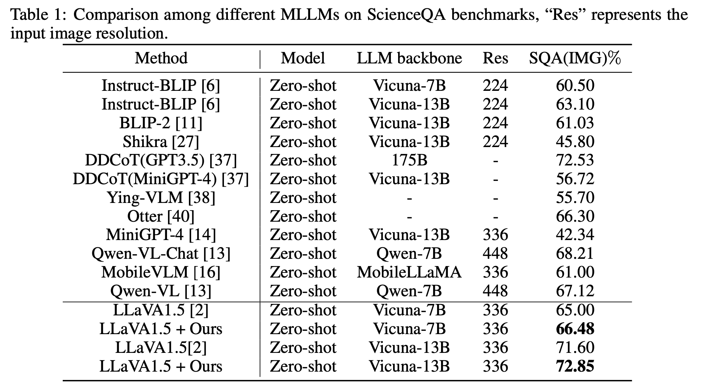

# Papers the might be useful

## 1. From Redundancy to Relevance: Enhancing Explainability in Multimodal Large Language Models

    https://arxiv.org/pdf/2406.06579v1

### High-level idea:

Using attention map guidance (Grad-CAM) for feature extraction. 

## 2.